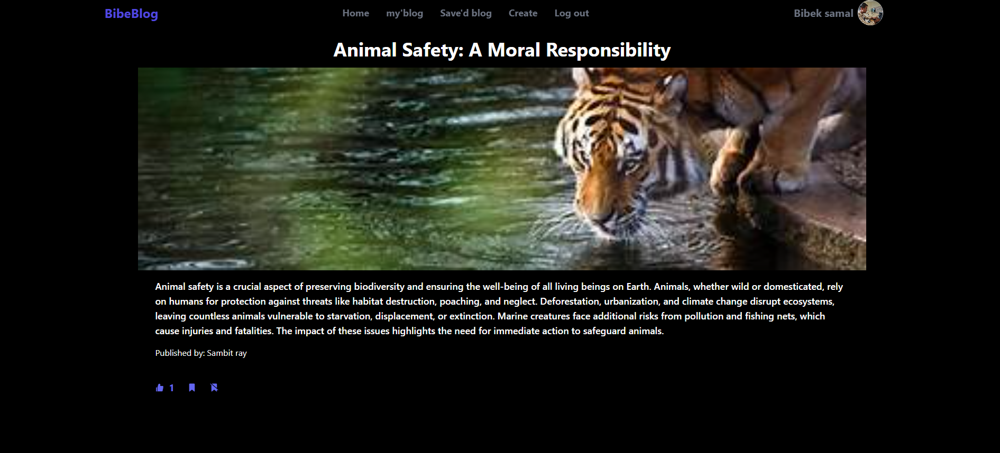

# BibeBlog

## Project Objective:

To build a modern, scalable, and efficient blogging platform where users can create, post, and manage their blogs seamlessly.
## Project Overview: Fullstack Blogging Website:

**BibeBlog** This fullstack blogging platform is designed to provide users with a seamless experience to create, post, and manage blogs. Utilizing React.js for a dynamic frontend, Cloudflare Workers with the Hono framework for a robust and scalable backend, and PostgreSQL managed via Prisma ORM for efficient database management, this project combines cutting-edge technologies to deliver a high-performance application. Key features include secure authentication, rich-text blog creation, a user-friendly dashboard, and responsive design, all hosted on modern deployment platforms for optimal scalability and reliability.

### Key Features:
### User Authentication
- **Register**: Users can create an account by providing necessary information, with proper validation for secure registration.
- **Sign In**: Registered users can sign in to the platform securely with their credentials.
- **Validation**: Both registration and sign-in processes include validation for correct input (e.g., email format, password strength).

### Blog Interaction
- **Create Blog**: Authenticated users can write and post their own blogs.
- **Read Blogs**: Users can read blogs posted by other users on the platform.
- **Like Blogs**: Users can like other people's blogs to show appreciation.
- **Save Blogs**: Users can save blogs to their personal section for later reading.

### User Profile
- **View Profile**: Users can view their own profile information, including their blogs and personal details.
  
### Blog Management
- **Delete Blog**: Users can delete their own blogs at any time from their profile.
This project is ideal for anyone looking to understand the implementation of a wallet system using modern web development technologies.

## Technologies Used
- **Frontend**: React, Tailwind CSS, Recoil, React Router DOM, React Hook Form, Zod
- **Backend**: Hono, Cloudflare Workers, JWT for Authentication, zod for validaton
- **Database**: Connection pooling using prisma with PostgreSQL
- **Package Manager**: NPM

## pages
### Home

### Auth

### Read blog

### Create blog

## Author

- [@Bibek samal](https://github.com/Bibek-only)
